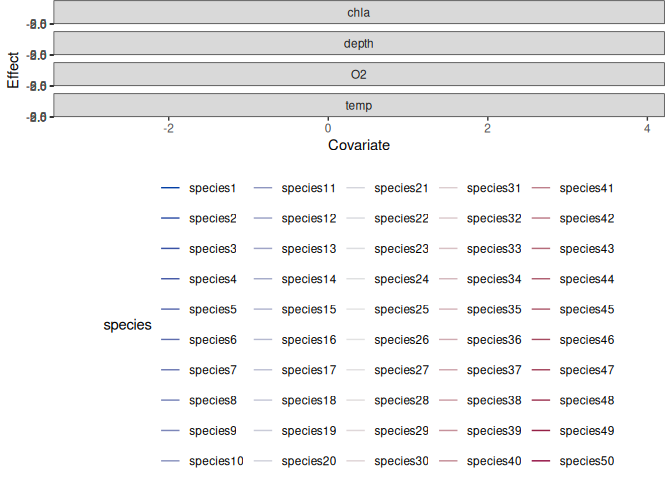
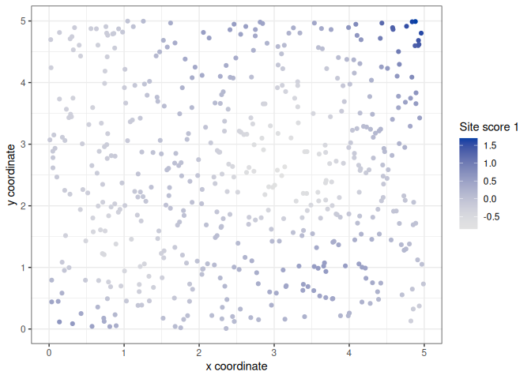
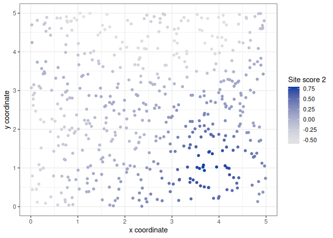

<!-- README.md is generated from README.Rmd. Please edit that file -->

# CBFM (Community-level basis function models)

<!--[](https://CRAN.R-project.org/package=CBFM) -->

<!--[](https://lifecycle.r-lib.org/articles/stages.html)-->

`CBFM` is an R package for spatial and spatio-temporal joint species
distributing modeling of multivariate abundance data, based on the idea
of using community-level (species-common) basis functions. It offers an
alternative and connected (but by no means necessarily superior)
approach to the popular spatio-temporal generalized linear latent
variable model (GLLVM) method.

As the name suggests, community-level basis function models (CBFMs) is
built on the idea of fixed-rank kriging (FRK), where spatially- and/or
temporally-indexed basis functions are included to account for
spatio-temporal correlations within and between species. In doing so,
CBFMs bear a lot of similarity to and thus can be set up as a type of
(big) generalized additive model or GAM. This in turns allows CBFMs to
be estimated in a computationally efficient and scalable manner, by
adapting some of the existing machinery available for fitting and
performing inference with GAMs.

The main manuscript introducing CBFMs as a method is available at
[here](https://doi.org/10.1111/2041-210X.14184).

# Installation

Currently, `CBFM` is available and can be installed from github with the
help of `pak` package using:

    pak::pkg_install("fhui28/CBFM")

Alternatively, or if the above does not work, you may download a
(supposedly) stable release of `CBFM` by choosing the latest release on
the right hand side of this Github webpage, and install it manually on
your machine.

# Getting started

**For getting started with `CBFM` though, please have a read of the
manuscript available [here](https://doi.org/10.1111/2041-210X.14184).
After, please install the package then have a look/work through the
examples in the help file for the main workhorse function,
`CBFM::CBFM()`.**

Some broad introductions to joint species distribution modeling,
especially using GLLVMs, please see [So Many Variables: Joint Modeling
in Community Ecology](https://doi.org/10.1016/j.tree.2015.09.007), [How
to make more out of community data? A conceptual framework and its
implementation as models and
software](https://doi.org/10.1111/ele.12757), and the textbook [Joint
Species Distribution Modelling, with Applications in
R](https://doi.org/10.1017/9781108591720).
<!--[Joint dynamic species distribution models: a tool for community ordination and spatio-temporal monitoring](https://doi.org/10.1111/geb.12464) -->

Note there are also some excellent existing packages to fit joint
species distribution models using GLLVMs, including:
[Hmsc](https://cran.r-project.org/package=Hmsc),
[GLLVM](https://cran.r-project.org/package=gllvm),
[sjSDM](https://github.com/TheoreticalEcology/s-jSDM), and
[VAST](https://rdrr.io/github/James-Thorson/VAST/), among others. All of
these have some capacity to handle spatio-temporal multivariate
abundance data using spatio-temporal GLLVMs, or variations thereof.

<!--For general introductions to spatial and/or temporal modeling using basis functions, please check out the excellent [FRK](https://cran.r-project.org/web/packages/FRK/index.html) package for fixed0rank kriging, which heavily inspired this package. Please also see the accompanying software article [FRK: An R Package for Spatial and Spatio-Temporal Prediction with Large Datasets](https://www.jstatsoft.org/article/view/v098i04) and references therein. A more gentle but nevertheless fantastic introduction to basis functions for modeling correlations aimed at ecologists is provided by [The basis function approach for modeling autocorrelation in ecological data](https://esajournals.onlinelibrary.wiley.com/doi/abs/10.1002/ecy.1674). Finally, it would be remiss not to highlight the seminar textbook [Generalized Additive Models: An Introduction with R](https://www.routledge.com/Generalized-Additive-Models-An-Introduction-with-R-Second-Edition/Wood/p/book/9781498728331), and the accompanying [mgcv](https://cran.r-project.org/web/packages/mgcv/index.html) package, which this package both utilizes and takes much inspiration from.-->

## Usage

The below is adapted directly from Example 1a of the help file for the
main workhorse function, `CBFM::CBFM()`, where a CBFM fitted to spatial
multivariate presence-absence data simulated from a spatial latent
variable model. Note this implies the true data generation process
differs from fitted model.

``` r
library(autoFRK)
library(FRK)
library(MASS)
library(mvabund)
library(mvtnorm)
library(ROCR)
library(sp)
library(geoR)
library(tidyverse)
library(colorspace)
library(CBFM)
```

First, we simulate some spatial multivariate binary (presence-absence)
data

``` r
set.seed(2025)
num_sites <- 500 # Number of (units) sites 
num_spp <- 50 # Number of species
num_X <- 4 # Number of regression slopes

spp_slopes <- matrix(runif(num_spp * num_X, -1, 1), nrow = num_spp)
spp_intercepts <- runif(num_spp, -2, 0)

# Simulate spatial coordinates and environmental covariate components
# We will use this information in later examples as well
xy <- data.frame(x = runif(num_sites, 0, 5), y = runif(num_sites, 0, 5))
X <- mvtnorm::rmvnorm(num_sites, mean = rep(0,4)) 
colnames(X) <- c("temp", "depth", "chla", "O2")
dat <- data.frame(xy, X)
mm <- model.matrix(~ temp + depth + chla + O2 - 1, data = dat) %>% 
scale %>% 
as.matrix

# Simulate latent variable component
# We will use this information in later examples as well
true_lvs <- grf(grid = cbind(xy$x, xy$y), nsim = 2, cov.model = "exponential", 
cov.pars = c(1, 2))$data %>% 
     as.matrix
#> grf: simulation on a set of locations provided by the user
#> grf: process with  1  covariance structure(s)
#> grf: nugget effect is: tausq= 0 
#> grf: covariance model 1 is: exponential(sigmasq=1, phi=2)
#> grf: decomposition algorithm used is:  cholesky 
#> grf: End of simulation procedure. Number of realizations: 2
spp_loadings <- matrix(runif(num_spp * 2, -1, 1), nrow = num_spp) 
set.seed(NULL)

# Simulate spatial multivariate abundance data (presence-absence)
eta <- tcrossprod(cbind(1,mm), cbind(spp_intercepts,spp_slopes)) + 
tcrossprod(true_lvs, spp_loadings)
simy <- matrix(rbinom(num_sites * num_spp, size = 1, 
prob = plogis(eta)), nrow = num_sites)
```

Next, we set up spatial basis functions for CBFM. As discussed in the
help file and in the [article](https://doi.org/10.1111/2041-210X.14184),
there are virtually endless choices for. Below, we will use
multi-resolution thin-plate splines (MRTS) basis functions from the
\[autoFRK()\] package as an (arbitrary) choice.

``` r
num_basisfunctions <- 25 # Number of spatial basis functions to use

train_basisfunctions <- mrts(dat[,c("x","y")], num_basisfunctions) %>% 
as.matrix %>%
{.[,-(1)]} # Remove the first intercept column
```

Fit the CBFM!

``` r
fitcbfm <- CBFM(y = simy, 
                formula = ~ temp + depth + chla + O2, 
                data = dat,
                B_space = train_basisfunctions, 
                family = binomial(), 
                control = list(trace = 1))
#> Compiling TMB C++ file...
#> using C++ compiler: 'g++ (Ubuntu 13.3.0-6ubuntu2~24.04) 13.3.0'
#> Calculating starting values...
#> Commencing model fitting...
#> Updating all coefficients and dispersion/power parameters (this includes running an inner EM algorithm if appropriate).
#> Updating between response correlation (covariance) matrices, G.
#> Updating covariance matrices for basis functions, Sigma, if required.
#> Iteration: 0  Difference in parameter estimates (mean squared error): 0.19057
#> Updating all coefficients and dispersion/power parameters (this includes running an inner EM algorithm if appropriate).
#> Updating between response correlation (covariance) matrices, G.
#> Updating covariance matrices for basis functions, Sigma, if required.
#> Iteration: 1  Difference in parameter estimates (mean squared error): 0.00181
#> Updating all coefficients and dispersion/power parameters (this includes running an inner EM algorithm if appropriate).
#> Updating between response correlation (covariance) matrices, G.
#> Updating covariance matrices for basis functions, Sigma, if required.
#> Iteration: 2  Difference in parameter estimates (mean squared error): 0.00024
#> Updating all coefficients and dispersion/power parameters (this includes running an inner EM algorithm if appropriate).
#> Updating between response correlation (covariance) matrices, G.
#> Updating covariance matrices for basis functions, Sigma, if required.
#> Iteration: 3  Difference in parameter estimates (mean squared error): 6e-05
#> Calculating (components of) the covariance (standard error) matrix...
```

Afterwards, you can a variety of standard modeling functions on the
model fit, such as `summary`, `fitted`, `predict`, and `plot`, among
others, along with more specific JSDM functions such as `ordinate`,
`varpart`, `corX`, `corB`, and `gratia_effects`. Below are some
illustrations.

``` r
fitcbfm
#> Call:
#> CBFM(y = simy, formula = ~temp + depth + chla + O2, data = dat, 
#>     B_space = train_basisfunctions, family = binomial(), control = list(trace = 1))
#> 
#> Family: binomial
#> No. of units: 500
#> No. of responses: 50
#> Responses-environment relationship fitted: ~temp + depth + chla + O2
#> Number of columns in model matrix induced by formula: 5
#> Were standard errors calculated? (TRUE/FALSE): TRUE
#> 
#> Basis functions included: B_space
#> Total number of basis functions: 24

# summary(fitcbfm) 
#' Not shown as the output is very long!

residuals(fitcbfm) %>% 
     str
#>  num [1:500, 1:50] 0.19 0.205 0.366 0.311 0.272 ...
#>  - attr(*, "dimnames")=List of 2
#>   ..$ : chr [1:500] "units1" "units2" "units3" "units4" ...
#>   ..$ : chr [1:50] "species1" "species2" "species3" "species4" ...

predict(fitcbfm) %>% 
     str
#>  num [1:500, 1:50] 1.45 1.357 0.548 0.798 0.986 ...
#>  - attr(*, "dimnames")=List of 2
#>   ..$ : chr [1:500] "1" "2" "3" "4" ...
#>   ..$ : chr [1:50] "species1" "species2" "species3" "species4" ...
```

``` r
varpart(fitcbfm) 
#> $varpart_X
#>  species1  species2  species3  species4  species5  species6  species7  species8 
#> 0.8356968 0.8071236 0.8215379 0.7860160 0.7869573 0.4406866 0.8126370 0.7011606 
#>  species9 species10 species11 species12 species13 species14 species15 species16 
#> 0.4978361 0.7652074 0.7958052 0.7339228 0.8896515 0.7798912 0.6957831 0.8456755 
#> species17 species18 species19 species20 species21 species22 species23 species24 
#> 0.6977357 0.6513606 0.7209768 0.8607639 0.4817789 0.6256921 0.7206322 0.7108684 
#> species25 species26 species27 species28 species29 species30 species31 species32 
#> 0.7010970 0.8525702 0.7314687 0.7959361 0.8213233 0.3949826 0.6820069 0.8604772 
#> species33 species34 species35 species36 species37 species38 species39 species40 
#> 0.7709989 0.8352444 0.8459971 0.6991546 0.7288195 0.8322753 0.8300749 0.8318143 
#> species41 species42 species43 species44 species45 species46 species47 species48 
#> 0.5631777 0.9095532 0.8254126 0.8186288 0.8997527 0.7564872 0.8788737 0.8344639 
#> species49 species50 
#> 0.6750379 0.6476261 
#> 
#> $varpart_B_space
#>   species1   species2   species3   species4   species5   species6   species7 
#> 0.16430318 0.19287642 0.17846213 0.21398397 0.21304266 0.55931340 0.18736296 
#>   species8   species9  species10  species11  species12  species13  species14 
#> 0.29883940 0.50216386 0.23479262 0.20419480 0.26607721 0.11034855 0.22010882 
#>  species15  species16  species17  species18  species19  species20  species21 
#> 0.30421685 0.15432455 0.30226434 0.34863938 0.27902323 0.13923614 0.51822106 
#>  species22  species23  species24  species25  species26  species27  species28 
#> 0.37430794 0.27936784 0.28913157 0.29890305 0.14742978 0.26853131 0.20406385 
#>  species29  species30  species31  species32  species33  species34  species35 
#> 0.17867669 0.60501736 0.31799313 0.13952275 0.22900112 0.16475558 0.15400292 
#>  species36  species37  species38  species39  species40  species41  species42 
#> 0.30084541 0.27118055 0.16772472 0.16992513 0.16818573 0.43682232 0.09044683 
#>  species43  species44  species45  species46  species47  species48  species49 
#> 0.17458739 0.18137117 0.10024730 0.24351284 0.12112634 0.16553610 0.32496205 
#>  species50 
#> 0.35237387
```

``` r
geteffects <- gratia_effects(fitcbfm)

geteffects$all_parametric_effects$species <- geteffects$all_parametric_effects$species %>%
     fct_inorder

ggplot(geteffects$all_parametric_effects %>% 
            filter(.term == "temp"), 
       aes(x = .value, y = .partial, color = species)) +
     geom_line() +
     geom_rug(aes(x = .value), sides = "b", show.legend = FALSE, color = "black") +
     scale_color_discrete_diverging() +
     facet_wrap(. ~ .term, nrow = 4) +
     labs(x = "Covariate", y = "Effect") +
     theme_bw() +
     theme(legend.position = "bottom")
```



``` r
getords <- ordinate(fitcbfm)

orddat <- data.frame(dat[,c("x","y")], 
                     getords$scores) 

orddat %>% 
     head
#>           x         y       Axis1       Axis2
#> 1 2.4102361 1.8604797 -0.31475024  0.02770395
#> 2 4.7484216 3.6814821  0.64813537  0.04050491
#> 3 0.4196939 4.4302971 -0.26628658 -0.09829066
#> 4 3.8437889 4.0704522  0.05458624 -0.58213466
#> 5 2.3863523 3.5680672  0.03202522 -0.35585071
#> 6 3.1606837 0.7024926  0.31367274  0.61447854

ggplot(orddat, aes(x = x, y = y, color = Axis1)) +
     geom_point() +
     scale_color_continuous_sequential() +
     labs(x = "x coordinate", y = "y coordinate", color = "Site score 1") +
     theme_bw()
```



``` r

ggplot(orddat, aes(x = x, y = y, color = Axis2)) +
     geom_point() +
     scale_color_continuous_sequential() +
     labs(x = "x coordinate", y = "y coordinate", color = "Site score 2") +
     theme_bw()
```

 \#
If you find any bugs and issues…

If you find something that looks like a bug/issue, please let us know
report it, so that we can resolve it and continue to improve this
project (interest and time pending). To report a bug/issue, please make
use of the Github issues and post it up there. As much as possible,
please include in the issue: 1. A description of the bug/issue; 2.
Paste-able code along with some comments that reproduces the problem
e.g., using the [reprex](https://cran.r-project.org/package=reprex)
package. If you also have an idea of how to fix the problem (Francis
tends to make a lot of mistakes in my code, so some may be easy
amendments!), then that is also much appreciated. 3. Required data files
etc…

Thanks heaps!
